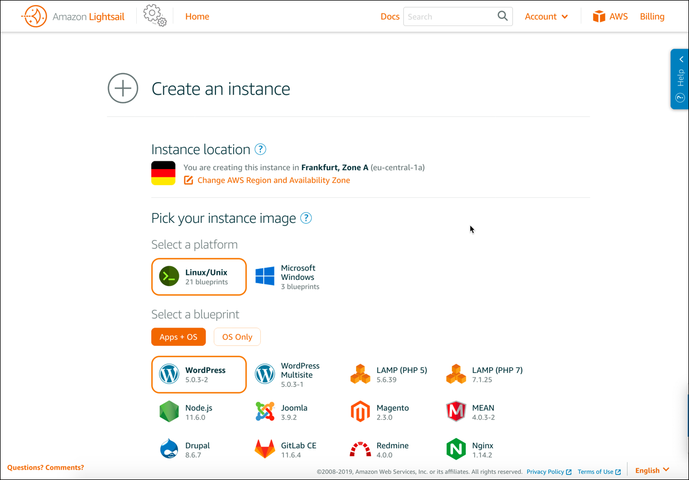
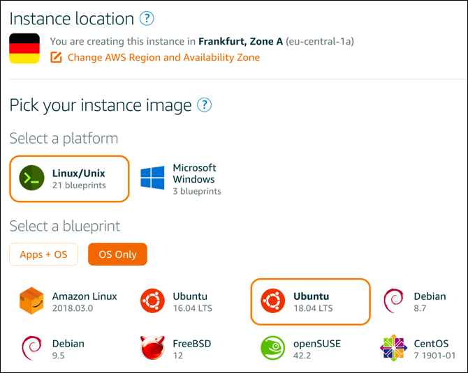
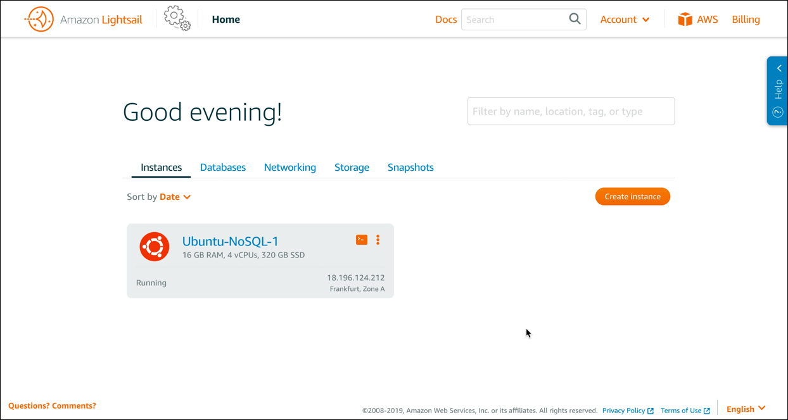
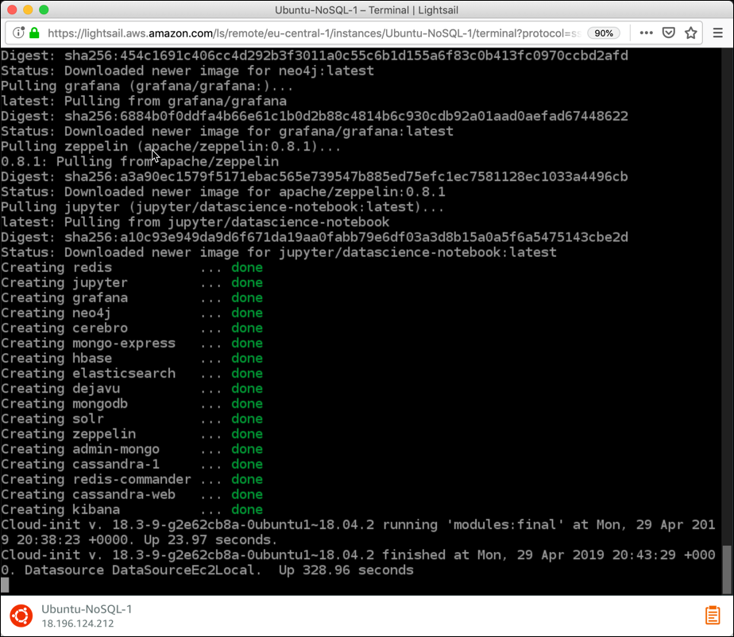
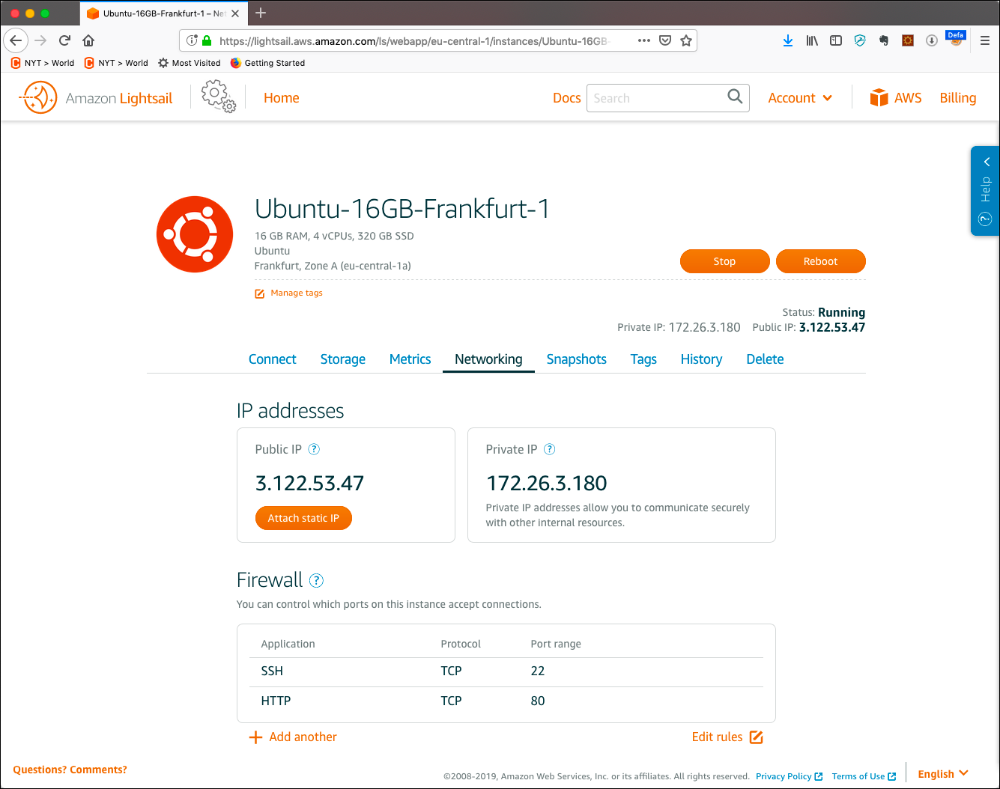
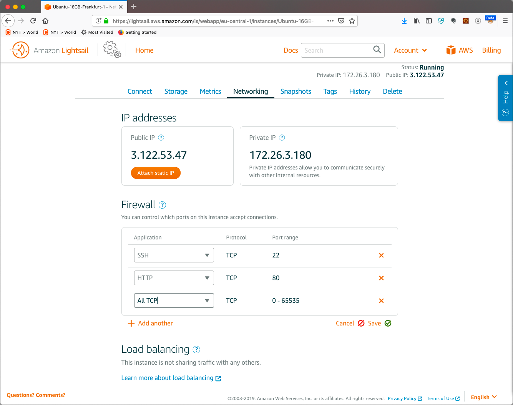
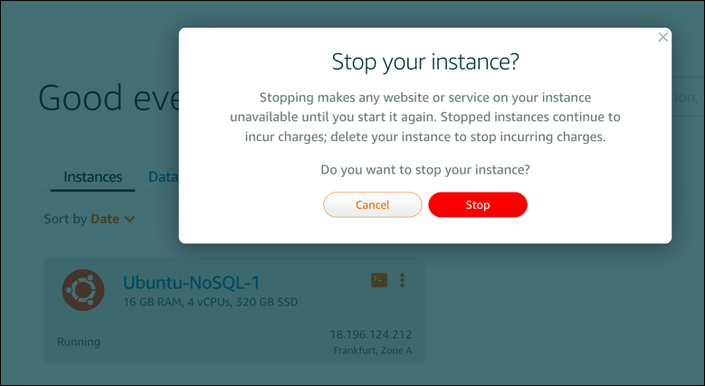
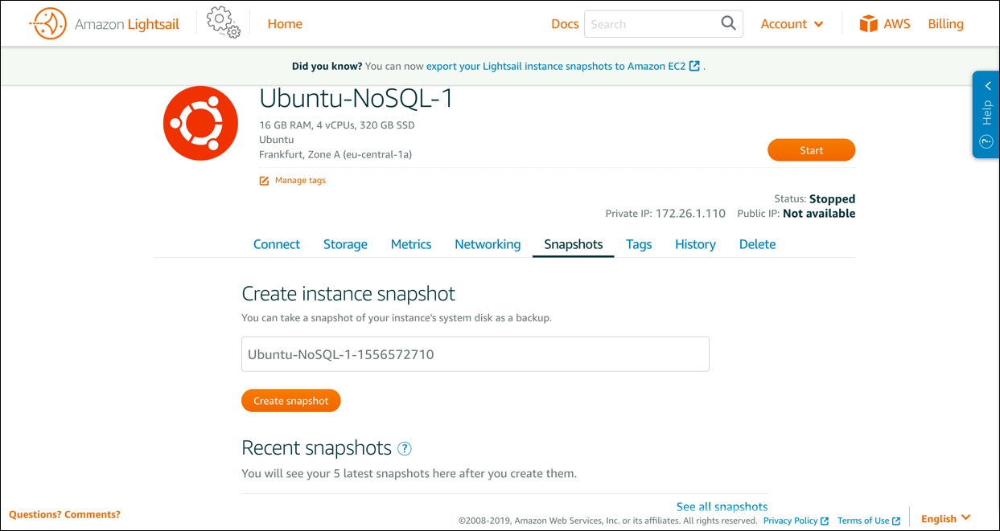

# AWS Lightsail

Navigate to the [AWS Console](http://console.aws.amazon.com) and login with your user. Click on the [Lightsail service](https://lightsail.aws.amazon.com/ls/webapp/home/instances).


## Provision instance

Click **Create instance** to navigate to the **Create an instance** dialog. 



Optionally change the **Instance Location** to a AWS region of your liking.
Keep **Linux/Unix** for the **Select a platform** and click on **OS Only** and select **Ubuntu 18.04 LTS** for the **Select a blueprint**. 



Scroll down to **Launch script** and add the the following script to the edit field. 

```
# Install Docker and Docker Compose
curl -fsSL https://download.docker.com/linux/ubuntu/gpg | sudo apt-key add -
add-apt-repository "deb [arch=amd64] https://download.docker.com/linux/ubuntu $(lsb_release -cs) stable edge"
apt-get install -y docker-ce
sudo usermod -aG docker ubuntu

# Install Docker Compose
curl -L "https://github.com/docker/compose/releases/download/1.24.0/docker-compose-$(uname -s)-$(uname -m)" -o /usr/local/bin/docker-compose
chmod +x /usr/local/bin/docker-compose
ln -s /usr/local/bin/docker-compose /usr/bin/docker-compose

# Prepare Environment Variables
export PUBLIC_IP=$(curl ipinfo.io/ip)
export DOCKER_HOST_IP=$(ip addr show eth0 | grep "inet\b" | awk '{print $2}' | cut -d/ -f1)

# needed for elasticsearch
sudo sysctl -w vm.max_map_count=262144   

# Get the project
cd /home/ubuntu 
git clone https://github.com/gschmutz/nosql-workshop.git
chown -R ubuntu:ubuntu nosql-workshop
cd nosql-workshop/01-environment/docker

# Startup Environment
sudo -E docker-compose up -d
```


Click on **Change SSH key pair** and leave the **Default** selected and then click on **Download** and save the file to a convinient location on your machine. Under **Choose your instance plan** click on the arrow on the right and select the **16 GB** instance.   

Under **Identify your istance** enter **Ubuntu-NoSQL-1** into the edit field. 


Click on **Create Instance** to start provisioning the instance. 

The new instance will show up in the Instances list on the Lightsail homepage. 



Click on the instance to navigate to the image details page. On the right you can find the Public IP address **18.196.124.212** of the newly created instance.


Click **Connect using SSH** to open the console and enter the follwoing command to watch the log file of the init script.

```
tail -f /var/log/cloud-init-output.log --lines 1000
```

The initializatio is finished when you see the `Creating xxxxx .... done` lines after all the docker images have been downloaded, which takes a couple of minutes. 



Optionally you can also SSH into the Lightsail instance using the **SSH key pair** you have downloaded above. For that open a terminal window (on Mac / Linux) or Putty (on Windows) and connect as ubuntu to the Public IP address of the instance.   

```
ssh -i LightsailDefaultKey-eu-central-1.pem ubuntu@18.196.124.212 
```

So with all services running, there is one last step to do. We have to configure the Firewall to allow traffic into the Lightsail instance. 



Click on the **Networking** tab/link to navigate to the network settings and under **Firewall** click on ** **Add another**.
For simplicity reasons, we allow all TCP traffic by selecting **All TCP** on port range **0 - 65535** and then click **Save**. 



Your instance is now ready to use. Complete the post installation steps documented the [here](README.md).

## Stop an Instance

To stop the instance, navigate to the instance overview and click on the drop-down menu and select **Stop**. 


Click on **Stop** to confirm stopping the instance. 



A stopped instance will still incur charges, you have to delete the instance completely to stop charges. 

## Delete an Instance

t.b.d.

## Create a snapshot of an Instance

When an instance is stopped, you can create a snapshot, which you can keep, even if later drop the instance to reduce costs.



You can always recreate an instance based on a snapshot. 

# Deprovision the environment

To stop the environment, execute the following command:

```
docker-compose stop
```

after that it can be re-started using `docker-compose start`.

To stop and remove all running container, execute the following command:

```
docker-compose down
```

